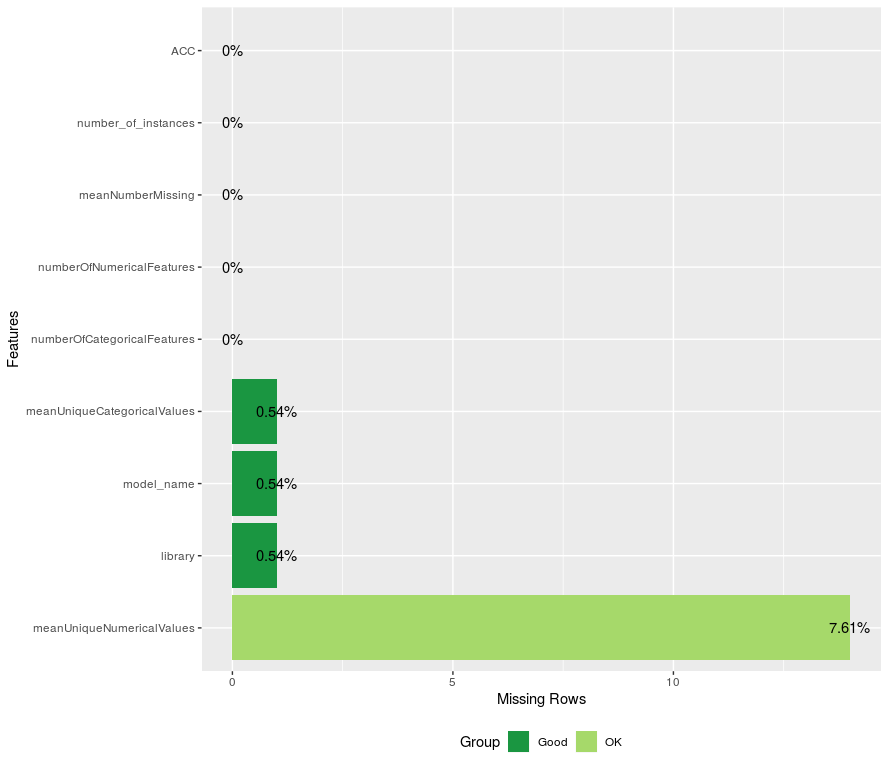
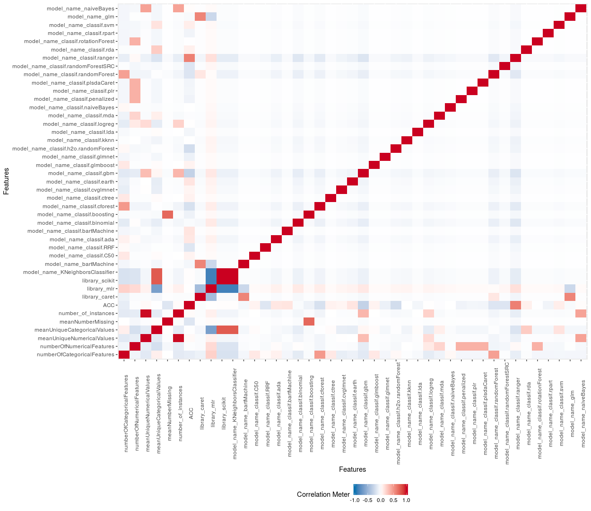
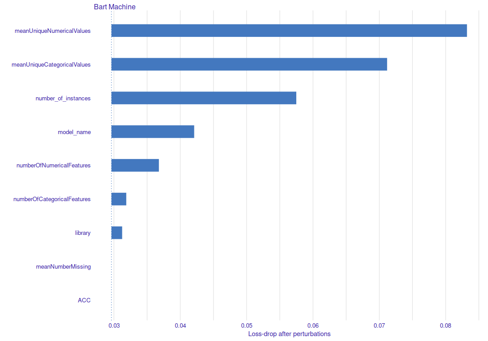

```{r setup, include=FALSE}
knitr::opts_chunk$set(echo = FALSE)
library(readr)
library(mlr)
library(ggplot2)

readr::read_csv("final_dataset.csv", col_types = cols(
  library = col_factor(),
  model_name = col_factor(),
  numberOfCategoricalFeatures = col_double(),
  numberOfNumericalFeatures = col_double(),
  meanUniqueNumericalValues = col_double(),
  meanUniqueCategoricalValues = col_double(),
  meanNumberMissing = col_double(),
  number_of_instances = col_double(),
  ACC = col_double()
)) -> df
df <- df[!is.na(df$meanUniqueNumericalValues), ] 
df <- df[!is.na(df$meanUniqueCategoricalValues), ] 
```

## Analiza zbioru
```{r, out.width = "500px", out.height= "360px"}
#nrow(df)
colnames(df)


```

## Analiza zbioru
```{r, out.height= "500px"}



```

## Variable impact

```{r, out.height= "500px"}



```

## Ocena jakości
`regr_task = makeRegrTask(id = "task", data = df, target = "ACC")`

`regr_lrn = makeLearner("regr.bartMachine")`

| Metric       | Score           |
| ------------- |:-------------:|
| mse.test.mean      | 0.0016731 |
| rmse.test.rmse      | 0.0409037 |
| mae.test.mean | 0.0252164      |
| rsq.test.mean | 0.8596590      |


## Podsumowanie
Trudne rzeczy:

- omijanie błędów w bazie modeli, ew. ich poprawki.

- wybranie zmiennych opisujących zbiór danych, w szczególności stworzenie takich cech, które istniałyby dla (prawie) wszystkich `dataset.json`

- odrzucanie obserwacji (gdy robi się ich dużo mniej)

- weryfikacja wyników?

