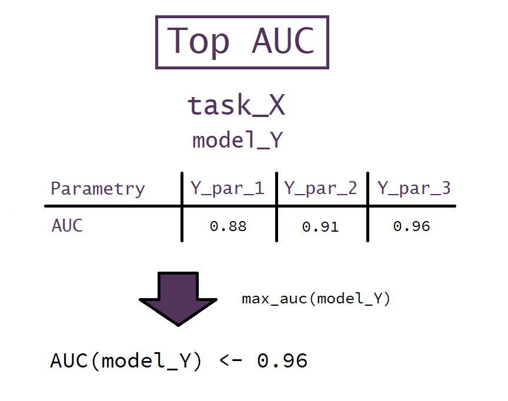
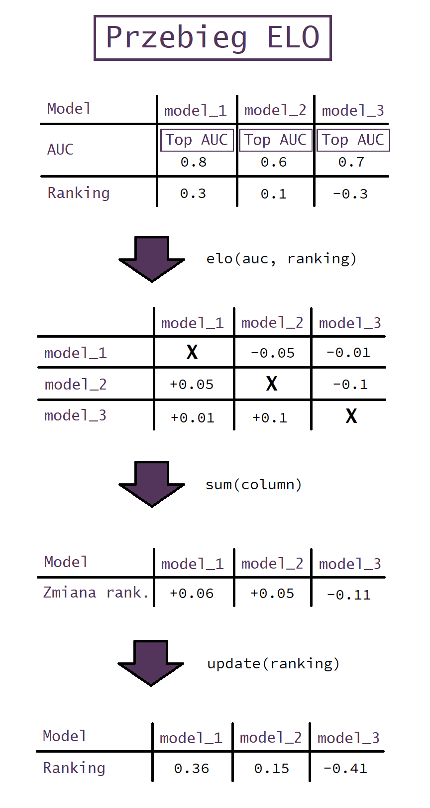
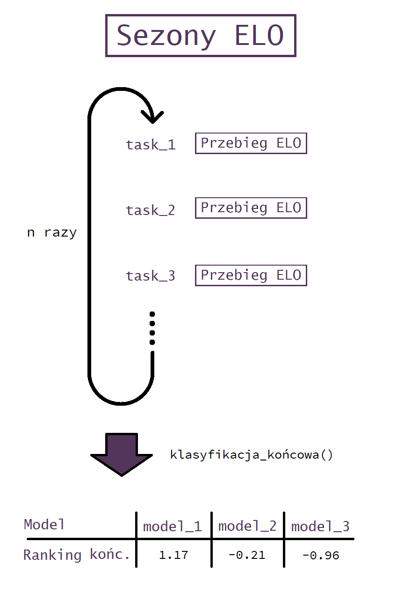

```{r include=FALSE}
knitr::opts_chunk$set(echo=FALSE, fig.width=10, fig.height=7, fig.align='center', message=FALSE, warning=FALSE)
library(kableExtra)
source("../functions/model_metrics.R")
```

# Zbiór testowy

Najpierw przyjrzeliśmy się zbiorowi, na którym mamy testować nasz model.

```{r }
test <- read.csv("../../WarsztatyBadawcze_test.csv", sep=";")
kable(head(test)) %>%
  kable_styling() %>%
  scroll_box(width = "100%")

DataExplorer::plot_correlation(test)
```


Łatwo można zauważyć, że niektóre z kolumn są duplikatami pozostałych. Usunęliśmy je. Kolumny numeryczne przeskalowaliśmy do przedziału [0,1], a kolumny dwuwartościowe \{0,1\} przechowywaliśmy dalej jako logiczne.

```{r echo=FALSE, fig.width=10, fig.height=7, fig.align='center', message=FALSE, warning=FALSE}
test_t <- read.csv("../WarsztatyBadawcze_transformed.csv")
kable(head(test_t)) %>%
  kable_styling() %>%
  scroll_box(width = "100%")
```

# Ranking modeli

W celu wyselekcjonowania najlepiej spisujących się modeli zaimplementowaliśmy ranking oparty na piłkarskim rankingu ELO.

Dla każdego modelu i tasku rozpatrywaliśmy wyłącznie najlepsze AUC spośród wszystkich instancji danego modelu o różnych parametrach.



Przebieg pojedynczej iteracji na pojedynczym tasku przedstawiamy na infografice poniżej. Taka iteracja jest analogią jednej kolejki ligowej.



Powyższą procedurę wykonujemy dla wszystkich tasków klasyfikacji binarnych w naszym zbiorze modeli *kilkukrotnie*. W ten sposób uzyskujemy bardziej wiarygodne wyniki, rozpięte na przestrzeni kilku "sezonów ligowych".



Możecie mieć jednak pytanie: co dzieje się w czarnej skrzynce `elo`? Stosowany przez nas wzór pozwalający policzyć wartość w jednej komórce tabeli kwadratowej modeli jest następujący:

$$scoreDiff = 2*|AUC_2 - 0.5| - 2*|AUC_1 - 0.5|$$
$$rankingDiff = \frac{ranking_1 - ranking_2}{tune}$$
$$cellValue = \frac{scoreDiff + 1}{2} - \frac{1}{10^{rankingDiff} + 1}$$

gdzie $tune$ to parametr domyślnie równy $5$, pozwalający dopasować istotność różnicy w rankingu do oczekiwanej różnicy w AUC.

*Jak uwzględnić podobieństwo datasetów?*

Zależało nam na tym, by promować dobre wyniki dla datasetów podobnych do docelowego. Potrzebowaliśmy miary zwracającej wartości z przedziału $[0, 1]$, przez które moglibyśmy przemnażać uzyskiwane wartości $cellValue$.

Historia, jak tego dokonaliśmy, będzie tematem następnego rozdziału.

# Podobienstwo datasetów

* **Pytanie**: Jak porównywać datasety?

* **Odpowiedź**: W sumie nie do końca wiadomo.

Nasz pomysł: na podstawie pliku *dataset.json* stworzyć wektor (lub wektory) opisujące własności datasetu, a następnie te wektory porównywać za pomocą symilaryterów®.

Dla każdego datasetu tworzymy dwa wektory: 
- wektor liczności faktorów o określonych liczbach poziomów,
- wektor liczbości numeryków® o określonych absolutnych skośnościach.

```{r include=FALSE}
reference <- read_json("../dataset.json")[[1]]
factors <- count_factors_range(reference)
skews <- count_nums_skewness(reference)
names(factors) <- c("2", "3-4", "5-7", "8-12", "13-25", "26-100", "101+")
names(skews) <- levels(cut(0, breaks = seq(0, 1, 0.1), include.lowest = TRUE))
```

```{r}
factors
skews
```

Najprostsza miara niepodobieństwa, jaką wymyśliśmy, to odległość euklidesowa. Naszą pierwszą miarą podobieństwa zaś była:

$$difference = -\sqrt{\sum(factors_1-factors_2)^2 + \sum(skewness_1-skewness_2)^2}$$
$$similarity = e^{-difference}$$

Innym pomysłem jest liczenie podobieństwa jako ilorazu na analogicznych pozycjach - bierzemy iloraz *elementwise*, jeśli dzieliliśmy przez 0, podstawiamy 1, jeśli iloraz jest większy niż 1, podstawiamy jego odwrotność, a na końcu bierzemy średnią.
$$similarity = mean(norm\bigg(\frac{factors_1}{factors_2} | \frac{skewness_1}{skewness_2}\bigg))$$


```{r}
A <- c(2,2,2,2,2)
B <- c(1,3,2,2,2)
C <- c(2,2,2,2,3)
D <- c(1,2,2,2,3)
```

W tych miarach jednak zachodzi coś, co nie całkiem nas zadowala - kolejność elementów w wektorach jest ignorowana. W pierwszej mierze, jeśli dataset **B** różni się od **A** tylko skośnością jednej kolumny, niepodobieństwo wynosi 2, podczas gdy niepodobieństwo między datasetem **A**, a datasetem **C** z dodatkową kolumną może wynosić w pewnym przypadku tylko 1.

```{r}
A
B
C
```

Pojawia się jeszcze inny problem - odległość datasetu **A** od datasetu **B** powinna być mniejsza niż odległość od datasetu **D**, którego skośność jednej kolumny różni się znacznie, podczas gdy przy **B** tylko trochę.

```{r}
A
B
D
```

Naszym wyborem jest trzecia miara - badanie ile *przesunięć* i *redukcji* należy wykonać, by upodobnić do siebie dwa wektory, gdzie *przesunięcie* oznacza zmnijeszenie jednego elementu o 1, a zwiększenie sąsiedniego o 1, natomiast *redukcja* to zmniejszenie jednego elementu o 1 (można ją wykonywać, gdy ciąg współrzędnych wektora majoryzuje ciąg współrzędnych drugiego). *Redukcje* liczymy z większą wagą, by uniknąć problemów wspominanych wcześniej.

$$difference = transforms(factors_1, factors_2) + transforms(skewness_1 + skewness_2)$$
$$similarity = e^{-difference}$$

# Our Bestiests

Jako że nasza procedura mogła zwrócić nieidealne wyniki (tylko i wyłącznie z powodu niedostatecznej liczby modeli, w żadnym razie za sprawą hipotetycznych niedoskonałości skryptu), wybraliśmy kilka datasetów oraz modeli, którymi zajęliśmy się dokładniej.

Przy wyborze czołowej piątki pomijaliśmy modele z Pythona, jako że z powodu skrajnej nieliczności ich wyniki nie były reprezentatywne. Ostatecznie (z powodu problemów technicznych) gbm zastąpiliśmy przez gamboost, który o włos nie załapał się do czołówki rankingu.

```{r}
chosen_models <- readRDS("../chosen_models.RData")
kable(chosen_models, digits = 10)
```

Przy wyborze datasetów mieliśmy mniej problemów, jako że każdy z nich był użyteczny w R.

```{r}
chosen_datasets <- readRDS("../chosen_datasets.RData")
kable(chosen_datasets)
```

Dla wymienionych modeli wykonaliśmy optymalizację bayesowską, oddzielnie na każdym datasecie. Uzyskane parametry posłużyły nam do zbudowania modeli, policzenia ich AUC oraz stworzenia małej bazy, na której wykonaliśmy ponownie procedurę liczenia rankingu ELO (wciąż z uwzględnieniem podobieństwa datasetów).

```{r}
final_scores <- readRDS("../final_scores.RData")
kable(final_scores, digits = 10)
```

Najlepszy wynik był udziałem modelu `ranger` i to właśnie na ten model nałożyliśmy ostateczny makijaż.

# Ostateczna odpowiedź (pierwsza)

Kiedy już ustaliliśmy, który model chcemy wybrać i które parametry są najskuteczniejsze na poszczególnych zbiorach, musieliśmy dokonać ostatecznego wyboru, które z nich dodamy do naszego modelu.

## min.node.size

Moda spośród wszyskich wartości wynosiła 6, średnia również była bardzo zbliżona, dlatego zdecydowaliśmy się na tę wartość.

## mtry

Tu optymalne wyniki dla każdego datasetu wyglądały zupełnie inaczej i rozpinały się od 1 do 8, więc postanowiliśmy sprawdzić model z każdą z uzyskanych wartości na każdym z wybranych datasetów, zobaczyć jak znaczne są różnice i dokonać wyboru.
```{r}
mtries <- readRDS("../compare_mtries.RData")
kable(mtries) 
```

Ostatecznie wybraliśmy *mtry* = 1

## splitrule

Do wyboru mieliśmy dwie opcje: *gini* lub *extratrees*.
```{r}
rules <- readRDS("../compare_splitrules.RData")
kable(rules) 
```

## Model

Nasz skrypt najpierw skaluje zbiór treningowy i testowy (treningowy według skali z testowego), a następnie trenuje starego, poczciwego *rangera* z parametrami 

- *min.node.size* = 6, 
- *mtry* = 1
- *splitrule* = *gini*
